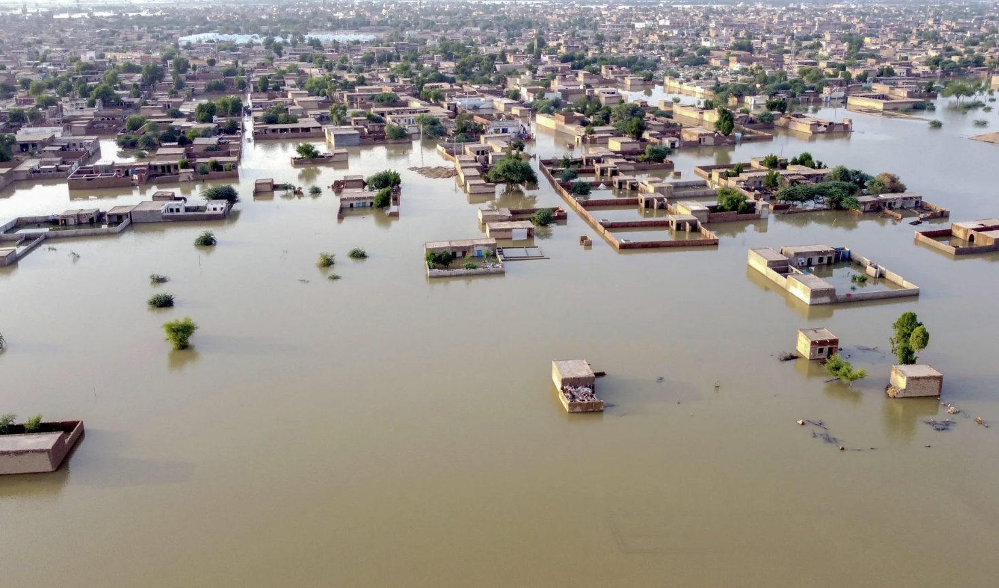

```{r setup, include = FALSE}
# Set code chunk defaults 
# Consider adding `message = FALSE` option
knitr::opts_chunk$set(echo = FALSE) 
                      
# Set R environment options
options(knitr.kable.NA = '')

# improve digit and NA display 
options(scipen = 1, knitr.kable.NA = '')

# load packages
library(tidyverse)
library(broom)
library(ggrepel)
library(GGally)
library(readr)
library(maps)
library(leaflet)
library(sf)
library(gapminder)
library(ggplot2)
library(mdsr)
library(dplyr)
library(gganimate)
library(transformr)
library(gifski)
library(png)
```

```{r, include = FALSE}
#read in data
newdata <- read_csv("archive/WorldSustainabilityDataset.csv")
```

```{r, include = FALSE}
#WRANGLE
initialwrangle <- newdata %>%
  rename('Renewable Energy Consumption (% of total final energy consumption)' = 'Renewable energy consumption (% of total final energy consumption) - EG.FEC.RNEW.ZS', 'Renewable Electricity Output (% of total electricity output)' = 'Renewable electricity output (% of total electricity output) - EG.ELC.RNEW.ZS', 'GDP per capita ($)' = 'GDP per capita (current US$) - NY.GDP.PCAP.CD', 'Access to Electricity (% of Pop)' = 'Access to electricity (% of population) - EG.ELC.ACCS.ZS', 'Country' = 'Country Name', 'Adjusted Savings: CO2 Damage' = 'Adjusted savings: carbon dioxide damage (% of GNI) - NY.ADJ.DCO2.GN.ZS', 'Adjusted Savings: Natural Resources Depletion' = 'Adjusted savings: natural resources depletion (% of GNI) - NY.ADJ.DRES.GN.ZS', 'Adjusted Savings: Net Forest Depletion' = 'Adjusted savings: net forest depletion (% of GNI) - NY.ADJ.DFOR.GN.ZS', 'Adjusted Savings: Particulate Emission Damage' = 'Adjusted savings: particulate emission damage (% of GNI) - NY.ADJ.DPEM.GN.ZS', 'Exports of Goods and Services' = 'Exports of goods and services (% of GDP) - NE.EXP.GNFS.ZS', 'Final Consumption Expenditure' = 'Final consumption expenditure (% of GDP) - NE.CON.TOTL.ZS', 'Imports of Goods and Services' = 'Imports of goods and services (% of GDP) - NE.IMP.GNFS.ZS', 'Inflation, Consumer Prices' = 'Inflation, consumer prices (annual %) - FP.CPI.TOTL.ZG', 'Proportion of Seats Held by Women In National Parliaments' = 'Proportion of seats held by women in national parliaments (%) - SG.GEN.PARL.ZS', 'Trade' = 'Trade (% of GDP) - NE.TRD.GNFS.ZS', 'Annual Production-Based Emissions of CO2' = 'Annual production-based emissions of carbon dioxide (CO2), measured in million tonnes', 'Income Classification' = 'Income Classification (World Bank Definition)', 'Life Expectancy at Birth' = 'Life expectancy at birth, total (years) - SP.DYN.LE00.IN', 'Total Population' = 'Population, total - SP.POP.TOTL', 'Regime Type' = 'Regime Type (RoW Measure Definition)', 'Rural Population' = 'Rural population (% of total population) - SP.RUR.TOTL.ZS', 'Total Natural Resources' = 'Total natural resources rents (% of GDP) - NY.GDP.TOTL.RT.ZS')%>%
    mutate(Country= case_when(Country=="Antigua and Barbuda" ~ "Antigua"
              , Country == "Bahamas, The" ~ "Bahamas"
              , Country == "Brunei Darussalam" ~ "Brunei"
              , Country == "Cote d'Ivoire" ~ "Cote d'Ivoire"
              , Country == "Congo, Dem. Rep." ~ "Democratic Republic of the Congo"
              , Country == "Congo, Rep." ~ "Republic of Congo"
              , Country == "Cabo Verde" ~ "Cape Verde"
              , Country == "Egypt, Arab Rep." ~ "Egypt"
              , Country == "United Kingdom" ~ "UK"
              , Country == "Gambia, The" ~ "Gambia"
              , Country == "Hong Kong SAR, China" ~ "China"
              , Country == "Iran, Islamic Rep." ~ "Iran"
              , Country == "Kyrgyz Republic" ~ "Kyrgyzstan"
              , Country == "Korea, Rep." ~ "South Korea"
              , Country == "Lao PDR" ~ "Laos"
              , Country == "St. Lucia" ~ "Saint Lucia"
              , Country == "Macao SAR, China" ~ "China"
              , Country == "Korea, Dem. People's Rep." ~ "North Korea"
              , Country == "West Bank and Gaza" ~ "Palestine"
              , Country == "Russian Federation" ~ "Russia"
              , Country == "Slovak Republic" ~ "Slovakia"
              , Country == "Eswatini" ~ "Swaziland"
              , Country == "Syrian Arab Republic" ~ "Syria"
              , Country == "Trinidad and Tobago" ~ "Trinidad"
              , Country == "United States" ~ "USA"
              , Country == "St. Vincent and the Grenadines" ~ "Grenadines"
              , Country == "Venezuela, RB" ~ "Venezuela"
              , TRUE ~ Country)) %>%
           select('Country', 'Year', 'Access to Electricity (% of Pop)', 'Renewable Energy Consumption (% of total final energy consumption)', 'GDP per capita ($)', 'Annual Production-Based Emissions of CO2', 'Life Expectancy at Birth')

```

# Introduction 

  We all have a role to play in creating a sustainable future for ourselves and for generations to come. One of the most pressing issues we face today is the high level of energy consumption and the resulting impact on the environment. In 2021, the United States alone consumed a staggering 3,930 terawatt hours of energy, with a significant portion of it coming from non-renewable sources like fossil fuels. This has a detrimental effect on the environment, contributing to climate change, air and water pollution, and other environmental issues. Melting glaciers are threatening to flood our valuable land and cities. An estimated 15 million people around the world are at risk of suffering sudden, deadly, and destructive flooding events due to the warming climate. By caring about sustainability and making conscious choices about energy use, we can help to reduce our carbon footprint and create a more sustainable future.
  
  At Amherst College, we have a responsibility to reduce our energy consumption and minimize our environmental impact. By reducing energy consumption, we can save money and preserve resources for future generations. In our analysis, we look at sustainability within a few freshman dorms at Amherst College. We then look at data across the world and compare energy consumption country-to-country. Our goal is to bring attention to just how much energy is consumed and consequently allow readers to analyze their own carbon footprints.
  


```{r, fig.cap='"Safe Space" by artist Kenesha Sneed', out.width="80%", fig.align="center"}

```

## Why should anyone care about this?

The easy thing to do is to go about your life and pretend nothing is happening. Ignorance is bliss, right? If everyone reading this thought this way, our sustainability habits would worsen. Caring about sustainability and taking action to address climate change is not only important, it is absolutely crucial for the survival of our planet and all the living beings that call it home. Ignoring climate change and continuing with unsustainable practices not only harms the environment but also has serious social and economic consequences. We are already witnessing the devastating effects of climate change, including rising sea levels, more frequent and severe natural disasters, and the displacement of vulnerable populations. We cannot continue to turn a blind eye to these issues and expect things to get better on their own. It is our responsibility to take action and make the necessary changes in our daily lives, as well as advocate for systemic changes at a larger scale. By prioritizing sustainability and addressing climate change, we can create a better future for ourselves and for future generations.

## Data Collection

The data from our Shiny App came from the Amherst College Office of Sustainability. As technology advances, the Sustainability Office has more access to resources that allow us to track energy consumption. In the newer dorms, the office is even able to track water usage. This data is not publicly available. As Amherst College students, we were able to meet with Weston Dripps, the Director of Sustainability. He kindly pulled the energy consumption data from North, South, James, and Stearns during the 2021-22 academic year. The original data is in an Excel file. 

The worldwide data comes from Kaggle, a trusted web browser that gives users access to large, downloadable datasets. This dataset titled, “World Sustainability Dataset” tracks the sustainability of 173 countries over 19 years. We have data on the years 2000-2018. Below is a link to the original dataset. 


# Content {.tabset}

The figure below shows World GDP over time. 
```{r}
#####GDP
world_map <- map_data(map="world")

chloropleth.gdp <- initialwrangle %>% 
  rename('gdp' = 'GDP per capita ($)') %>%
  arrange(Country) %>%
  #filter(Year == 2018) %>%
  right_join(world_map, by = c("Country"= "region"))


visual1 <- ggplot(chloropleth.gdp, aes(x=long, y=lat, group = group, #creates the plot
                                      fill = gdp)) +
  geom_polygon() +
   transition_time(Year) +
  labs(fill = "GDP ($) "
       , title = 'Figure 1 - World GDP in: {frame_time}'
       , caption = "Note: some countries are missing GDP data") +
  scale_fill_distiller(palette = "Spectral")

animate(fps = 4, visual1, nframes = 19)
```

```{r}
######Energy Consumption
chloropleth.renew <- initialwrangle %>% 
  rename('renew' = 'Renewable Energy Consumption (% of total final energy consumption)') %>%
  arrange(Country) %>%
  #filter(Year == 2018) %>%
  right_join(world_map, by = c("Country"= "region"))

visual2 <- ggplot(chloropleth.renew, aes(x=long, y=lat, group = group, #creates the plot
                                      fill = renew)) +
  geom_polygon() +
  transition_time(Year) +
  labs(fill = "Renewable 
  Energy Consumption"
       , title = 'Figure 2 - World Renewable Energy Consumption 
  (% of total final energy consumption) in: {frame_time}'
       ) +
  scale_fill_distiller(palette = "Spectral")

animate(fps = 4, visual2, nframes = 19)
```

## Findings

Looking at the energy usage at Amherst College inspired us to to explore other topics of sustainability in the world, and how countries differ in their sustainability. This directly lead to our interest in examining renewable energy consumption for each country on a map, by using a choropleth. Moreover, we used gganimate in order to distinguish between the change in renewable energy consumption from yearly changes. Renewable energy consumption is the proportion of energy that comes from renewable energy sources. This led us to looking at GDP as well, which stands for Gross Domestic Product. GDP is a measure for a countries economic output, as it measures a countries value of goods and services produced in their own country. Often countries with higher GDP have greater standards of living. We also look at annual based emissions of carbon dioxide, which is the amount of carbon dioxide that is released into the atmosphere. Increased emissions are often caused by burning fossil fuels and large industrialism. Another variable we looked at is life expectancy at birth which is strongly related to a country’s economic status and health care oppertunities. The final variable is access to electricity, and it is affected by a country’s economic status as well. 

## Links 

Clicking on the link below will take you to our Shiny App. Here, we have used actual energy consumption data from the Office of Sustainability at Amherst College to measure energy consumption during the 2021-2022 academic year. In the first plot, which is a line chart, we looked at a time series where we tracked the average day of energy consumption in each dorm. The energy consumption was measured in 5 minutes increments and in Kilowatts Per Hour (kw/h). In the app, the user is able to select which freshman dorm they desire to inspect, and whether they want to measure the energy consumption in total energy every 5 minutes or energy usage per capita. In the following section of the app, seasonal energy usage shows the seasonal differences in energy consumption for each dorm from the use of bar charts. In this panel of the Shiny app, you can select which season you would like to view as well as whether you want the data to be presented in total energy per 5 minutes or in energy per capita. The last feature of the shiny app displays energy usage per day type. This allows you to select energy use for any day of the week, as well are giving one the ability to plot either weekdays or weekends. This is shown through bar graphs are well. 

[Shiny App](https://hankim25.shinyapps.io/shiny1-sustainability/) 

Link to the Sustainability Dataset: https://www.kaggle.com/datasets/truecue/worldsustainabilitydataset/code?resource=download 

## Visualizations 

Visualizations, particularly interactive ones, will be well-received. That said, do not overuse visualizations. You may be better off with one complicated but well-crafted visualization as opposed to many quick-and-dirty plots. Any plots should be well-thought-out, properly labeled, informative, and visually appealing.

If you want to include dynamic visualizations or tables, you should explore your options from packages that are built from [**htmlwidgets**](https://www.htmlwidgets.org/showcase_leaflet.html). These **htmlwidgets**-based packages offer ways to build lighterweight, dynamic visualizations or tables that don't require an R server to run! A more complete list of packages is available on the linked website, but a short list includes:

* [**plotly**](https://plot.ly/r/): Interactive graphics with D3
* [**leaflet**](https://rstudio.github.io/leaflet/): Interactive maps with OpenStreetMap
* [**dygraphs**](http://rstudio.github.io/dygraphs): Interactive time series visualization
* [**visNetwork**](http://dataknowledge.github.io/visNetwork): Network graph visualization vis.js
* [**sparkline**](https://github.com/htmlwidgets/sparkline): Small inline charts
* [**threejs**](https://github.com/bwlewis/rthreejs): Interactive 3D graphics
    


```{r ds-salaries-app, out.width = "300%", out.extra = 'data-external="1" frameborder="no"', fig.cap = "[Sustainability Shiny App](https://hankim25.shinyapps.io/shiny1-sustainability/)"}
knitr::include_app("https://hankim25.shinyapps.io/shiny1-sustainability/",
                   height = "1000px")
```


## Tables

### **DT** package

The [**DT** package](https://rstudio.github.io/DT/) is great for making dynamic tables that can be displayed, searched, and filtered by the user without needing an R server or Shiny app!

Note: you should load any packages you use in the `setup` code chunk as usual. The `library()` functions are shown below just for demonstration.

```{r dt-example, message=FALSE, echo=TRUE}
library(DT)
mtcars %>% 
  select(mpg, cyl, hp) %>% 
  datatable(colnames = c("MPG", "Number of cylinders", "Horsepower"),
            filter = 'top',
            options = list(pageLength = 10, autoWidth = TRUE))
```

### **kableExtra** package

You can also use [**kableExtra**](https://cran.r-project.org/web/packages/kableExtra/vignettes/awesome_table_in_html.html) for customizing HTML tables.

```{r kable-example, echo=TRUE, message=FALSE}
library(kableExtra)
summary(cars) %>%
  kbl(col.names = c("Speed", "Distance"),
      row.names = FALSE) %>%
  kable_styling(bootstrap_options = "striped",
                full_width = FALSE) %>%
  row_spec(0, bold = TRUE) %>%
  column_spec(1:2, width = "1.5in") 
```


## Images

Images and gifs can be displayed using code chunks:

```{r, fig.cap='"Safe Space" by artist Kenesha Sneed', out.width="80%", fig.align="center"}
knitr::include_graphics("img/Kenesha-Sneed_safe-space.jpeg")
```


```{r, fig.cap="This is a figure caption", out.width="50%", fig.align="center"}
knitr::include_graphics("https://media.giphy.com/media/H7ZrrA9V2pd3Tehdds/giphy.gif")
```

You may also use Markdown syntax for displaying images as shown below, but code chunks offer easier customization of the image size and alignment.


Either way, the file path can be a local path within your project directory or a URL for an image hosted online. This syntax works for PNG, PDF, JPG, and even GIF formats.


# Limitations & Conclusions

## Limitations {.tabset}

There were a few limitations of our work. First, as with most large datasets, there was some missing data. We had to pick and chose certain variables that had the most data. By dropping the na’s, we inevitably lose the ability to broaden the scope of our analysis. With the world sustainability dataset, the data was collected from 173 different countries over 19 years. This is a huge amount of data with large variability so we need to be careful. Due to the varying economic status of each country, it’s hard to gather information for all variables. We proceeded with caution in our analysis. 

As for our Shiny app, we only had data from four out of the 34 residence halls at Amherst College. These four dorms are freshman dorms so we shouldn’t conclude that our findings represent the energy consumption for the Amherst College student body as a whole.


## Conclusions

We hope through this blog post that readers are aware of the importance of sustainability in the long run. As Earth gets warmer by the day, everyone can do their part to reduce their carbon footprint. Sustainability is crucial for the health of our planet and the well-being of future generations. By making small changes in our daily lives, we can all do our part to reduce our carbon footprint and live more sustainably. Whether it's by using reusable bags, reducing energy consumption, supporting sustainable businesses, or choosing eco-friendly products, every action counts. It's important to remember that we are all responsible for the impact we have on the environment, and by taking steps toward sustainability, we can make a significant difference.


You can make a bulleted list like this:

* item 1
* item 2
* item 3


### Numbered list


You can make a numbered list like this

1. First thing I want to say
2. Second thing I want to say
3. Third thing I want to say


## Column formatting

<!-- Begin columns environment -->
:::::: {style="display: flex; font-size: large;"}

<!-- Create a column -->
::: {}
### Content Column 1

Lorem ipsum dolor sit amet, consectetur adipiscing elit. Suspendisse vel ipsum eu sem facilisis porttitor. Integer eu tristique lectus. Vestibulum nisi risus, porta sit amet cursus nec, auctor ac tellus. Integer egestas viverra rhoncus. Fusce id sem non ante vestibulum posuere ac sed lorem. Proin id felis a mi pellentesque viverra in at nulla. Duis augue nulla, aliquet ac ligula a, sagittis varius lorem.


:::

<!-- Create another column (this one is just adding horizontal space to separate content) -->
::: {}
<div class="horizontalgap" style="width:60px"></div>
:::

<!-- Create another column -->
::: {}

### Content Column 2

Aliquam non ante et erat luctus hendrerit eu ac justo. Fusce lacinia pulvinar neque non laoreet. Fusce vitae mauris pharetra, scelerisque purus eget, pharetra nisl. Aenean volutpat elementum tortor vitae rhoncus. Phasellus nec tellus euismod neque congue imperdiet tincidunt in mauris. Morbi eu lorem molestie, hendrerit lorem nec, semper massa. Sed vulputate hendrerit ex, eget cursus purus. Pellentesque consequat erat leo, eleifend porttitor lacus porta at. Vivamus faucibus quam ipsum, id condimentum ligula malesuada ultrices. Nullam luctus leo elit, vitae rutrum nibh venenatis eget. Nam at sodales purus. Proin nulla tellus, lacinia eget pretium sed, vehicula aliquet neque. Morbi vel eros elementum, suscipit elit eu, consequat libero. Nulla nec aliquet neque. Nunc bibendum sapien lectus, sed elementum nisi rutrum non. Ut vulputate at lacus eget maximus.

```{r, out.width="80%", fig.align="right"}
mtcars %>% 
  ggplot(aes(x = wt, y = mpg)) +
  geom_point()
```

:::
::::::
<!-- End columns environment with matching length indicator-->


# Customizing your blog design


As a *final* detail **only** if you have time, you can explore options for customizing the style of your blog. By default, we are using the `readthedown` theme from the [**rmdformats** package](https://github.com/juba/rmdformats) (see Line 6 of this file if you want to switch out themes).


## Theme
You can use the [**rmdformats** package](https://github.com/juba/rmdformats) to play around with some pre-built themes. There are, I'm sure, many many many more similar packages with built in themes, or you can look into how to include a CSS code chunk to customize aspects of a theme.  

Using the **rmdformats** package, you can change the theme itself (Line 6): 

* `rmdformats::readthedown`
* `rmdformats::downcute` 
  * For `downcute` only, you can add a new indented line below Line 6 with the code `downcute_theme: "chaos"` for the `downcute chaos` theme
* `rmdformats::robobook` 
* `rmdformats::material`

You can explore additional YAML options by looking at the [**rmdformats** package](https://github.com/juba/rmdformats) page or running, for example, `?rmdformats::readthedown()` to see the help documentation for a particular theme from the package. 

## Synax highlighting

You can also change the code chunk syntax highlighting option (Line 7, `highlight`): 

* `"default"`
* `"tango"`
* `"pygments"`
* `"kate"`
* `"monochrome"`
* `"espresso"`
* `"zenburn"`
* `"haddock"`
* `"textmate"` 
* `NULL` for no syntax highlighting (not recommended)

## Font size, type, and other customization

Further customization requires adding a CSS style file or code chunk or incorporating other development options. Customization beyond the **rmdformats** package should be your lowest and final priority for the project. Ensure your content is fully prepared first.


# References

<!-- Textbook -->
1. Baumer, B. S., Kaplan, D. T., and Horton, N. J. (2021), *Modern Data Science with R* (2nd ed.), Boca Raton, FL: CRC Press.

<!-- Website -->
2. “U.S. electricity consumption 2021.” Statista, 25 January 2023, https://www.statista.com/statistics/201794/us-electricity-consumption-since-1975/. Accessed 2 May 2023.

<!-- Journal article -->
3. Jones, Benji. “Pakistan flooding: How melting glaciers fueled the disaster.” Vox, 30 August 2022, https://www.vox.com/science-and-health/2022/8/30/23327341/pakistan-flooding-monsoon-melting-glaciers-climate-change. Accessed 2 May 2023.

<!-- Dataset -->
4. “Home.” Kaggle, https://www.kaggle.com/datasets/truecue/worldsustainabilitydataset?resource=download. Accessed 2 May 2023.

<!-- R package -->
5. Wickham H, Averick M, Bryan J, Chang W, McGowan LD, François R,
  Grolemund G, Hayes A, Henry L, Hester J, Kuhn M, Pedersen TL, Miller E,
  Bache SM, Müller K, Ooms J, Robinson D, Seidel DP, Spinu V, Takahashi K,
  Vaughan D, Wilke C, Woo K, Yutani H (2019). “Welcome to the tidyverse.”
  _Journal of Open Source Software_, *4*(43), 1686.
  doi:10.21105/joss.01686 <https://doi.org/10.21105/joss.01686>. 

<!-- R package -->
6. Robinson D, Hayes A, Couch S (2023). _broom: Convert Statistical Objects
  into Tidy Tibbles_. R package version 1.0.3,
  <https://CRAN.R-project.org/package=broom>.
  
<!-- R package -->
7. Slowikowski K (2023). _ggrepel: Automatically Position Non-Overlapping
  Text Labels with 'ggplot2'_. R package version 0.9.3,
  <https://CRAN.R-project.org/package=ggrepel>.

<!-- R package -->
8. Schloerke B, Cook D, Larmarange J, Briatte F, Marbach M, Thoen E, Elberg
  A, Crowley J (2021). _GGally: Extension to 'ggplot2'_. R package version
  2.1.2, <https://CRAN.R-project.org/package=GGally>.
  
<!-- R package -->  
9. Wickham H, Hester J, Bryan J (2022). _readr: Read Rectangular Text
  Data_. R package version 2.1.3,
  <https://CRAN.R-project.org/package=readr>.
  
<!-- R package -->  
10. Becker OScbRA, Minka ARWRvbRBEbTP, Deckmyn. A (2022). _maps: Draw
  Geographical Maps_. R package version 3.4.1,
  <https://CRAN.R-project.org/package=maps>.
  
<!-- R package --> 
11. Cheng J, Karambelkar B, Xie Y (2023). _leaflet: Create Interactive Web
  Maps with the JavaScript 'Leaflet' Library_. R package version 2.1.2,
  <https://CRAN.R-project.org/package=leaflet>.
  
<!-- R package -->  
12. Pebesma, E., 2018. Simple Features for R: Standardized Support for
  Spatial Vector Data. The R Journal 10 (1), 439-446,
  https://doi.org/10.32614/RJ-2018-009 
  
<!-- R package -->  
13. Bryan J (2023). _gapminder: Data from Gapminder_. R package version
  1.0.0, <https://CRAN.R-project.org/package=gapminder>.
  
<!-- R package -->  
14. H. Wickham. ggplot2: Elegant Graphics for Data Analysis. Springer-Verlag
  New York, 2016.
  
<!-- R package -->
15. Benjamin S. Baumer, Daniel T. Kaplan, Nicholas J. Horton (2021). Modern
  Data Science with R. 2nd edition, Chapman and Hall/CRC Press: Boca
  Raton, 1--673. URL
  https://www.routledge.com/Modern-Data-Science-with-R/Baumer-Kaplan-Horton/p/book/9780367191498.
  
<!-- R package -->
16. Wickham H, François R, Henry L, Müller K, Vaughan D (2023). _dplyr: A
  Grammar of Data Manipulation_. R package version 1.1.0,
  <https://CRAN.R-project.org/package=dplyr>.
  
<!-- R package --> 
17. Pedersen T, Robinson D (2022). _gganimate: A Grammar of Animated
  Graphics_. R package version 1.0.8,
  <https://CRAN.R-project.org/package=gganimate>.
  
<!-- R package -->
18. Pedersen T (2022). _transformr: Polygon and Path Transformations_. R
  package version 0.1.4, <https://CRAN.R-project.org/package=transformr>.
  
<!-- R package -->
19. Ooms J (2022). _gifski: Highest Quality GIF Encoder_. R package version
  1.6.6-1, <https://CRAN.R-project.org/package=gifski>.
  
<!-- R package -->
20. Urbanek S (2022). _png: Read and write PNG images_. R package version
  0.1-8, <https://CRAN.R-project.org/package=png>.

