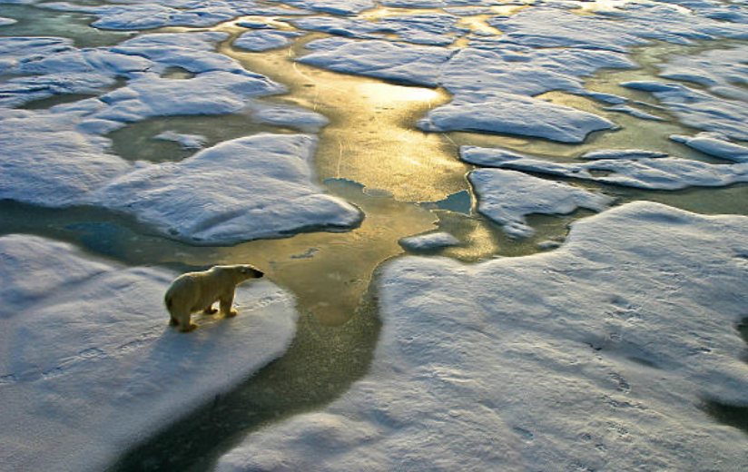
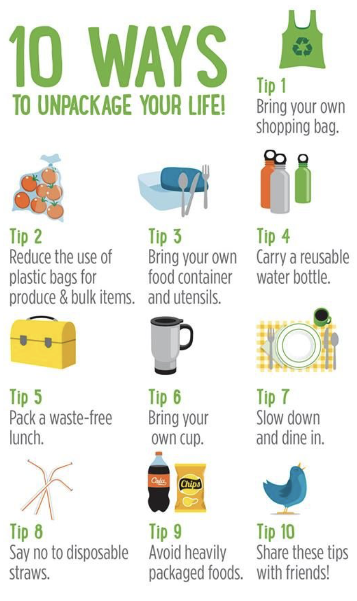
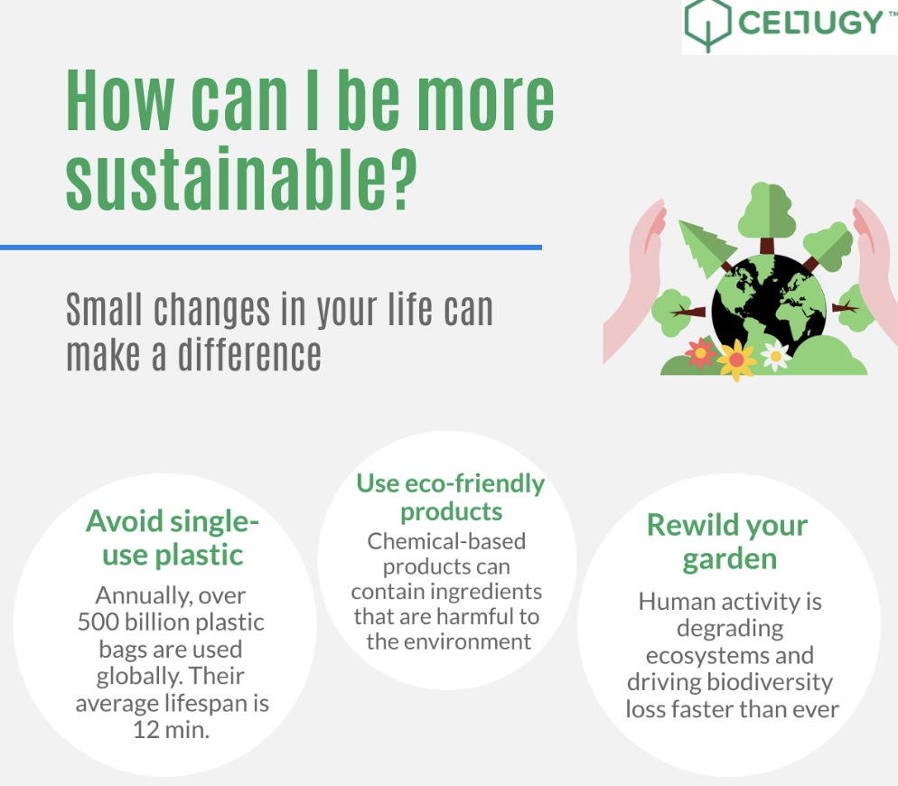

```{r setup, include = FALSE}
# Set code chunk defaults 
# Consider adding `message = FALSE` option
knitr::opts_chunk$set(echo = FALSE) 
                      
# Set R environment options
options(knitr.kable.NA = '')

# improve digit and NA display 
options(scipen = 1, knitr.kable.NA = '')

# load packages
library(tidyverse)
library(broom)
library(ggrepel)
library(GGally)
library(readr)
library(maps)
library(leaflet)
library(sf)
library(gapminder)
library(ggplot2)
library(mdsr)
library(dplyr)
library(gganimate)
library(transformr)
library(gifski)
library(png)
```

```{r, include = FALSE}
#read in data
newdata <- read_csv("archive/WorldSustainabilityDataset.csv")
```

```{r, include = FALSE}
#WRANGLE
initialwrangle <- newdata %>%
  rename('Renewable Energy Consumption (% of total final energy consumption)' = 'Renewable energy consumption (% of total final energy consumption) - EG.FEC.RNEW.ZS', 'Renewable Electricity Output (% of total electricity output)' = 'Renewable electricity output (% of total electricity output) - EG.ELC.RNEW.ZS', 'GDP per capita ($)' = 'GDP per capita (current US$) - NY.GDP.PCAP.CD', 'Access to Electricity (% of Pop)' = 'Access to electricity (% of population) - EG.ELC.ACCS.ZS', 'Country' = 'Country Name', 'Adjusted Savings: CO2 Damage' = 'Adjusted savings: carbon dioxide damage (% of GNI) - NY.ADJ.DCO2.GN.ZS', 'Adjusted Savings: Natural Resources Depletion' = 'Adjusted savings: natural resources depletion (% of GNI) - NY.ADJ.DRES.GN.ZS', 'Adjusted Savings: Net Forest Depletion' = 'Adjusted savings: net forest depletion (% of GNI) - NY.ADJ.DFOR.GN.ZS', 'Adjusted Savings: Particulate Emission Damage' = 'Adjusted savings: particulate emission damage (% of GNI) - NY.ADJ.DPEM.GN.ZS', 'Exports of Goods and Services' = 'Exports of goods and services (% of GDP) - NE.EXP.GNFS.ZS', 'Final Consumption Expenditure' = 'Final consumption expenditure (% of GDP) - NE.CON.TOTL.ZS', 'Imports of Goods and Services' = 'Imports of goods and services (% of GDP) - NE.IMP.GNFS.ZS', 'Inflation, Consumer Prices' = 'Inflation, consumer prices (annual %) - FP.CPI.TOTL.ZG', 'Proportion of Seats Held by Women In National Parliaments' = 'Proportion of seats held by women in national parliaments (%) - SG.GEN.PARL.ZS', 'Trade' = 'Trade (% of GDP) - NE.TRD.GNFS.ZS', 'Annual Production-Based Emissions of CO2' = 'Annual production-based emissions of carbon dioxide (CO2), measured in million tonnes', 'Income Classification' = 'Income Classification (World Bank Definition)', 'Life Expectancy at Birth' = 'Life expectancy at birth, total (years) - SP.DYN.LE00.IN', 'Total Population' = 'Population, total - SP.POP.TOTL', 'Regime Type' = 'Regime Type (RoW Measure Definition)', 'Rural Population' = 'Rural population (% of total population) - SP.RUR.TOTL.ZS', 'Total Natural Resources' = 'Total natural resources rents (% of GDP) - NY.GDP.TOTL.RT.ZS')%>%
    mutate(Country= case_when(Country=="Antigua and Barbuda" ~ "Antigua"
              , Country == "Bahamas, The" ~ "Bahamas"
              , Country == "Brunei Darussalam" ~ "Brunei"
              , Country == "Cote d'Ivoire" ~ "Cote d'Ivoire"
              , Country == "Congo, Dem. Rep." ~ "Democratic Republic of the Congo"
              , Country == "Congo, Rep." ~ "Republic of Congo"
              , Country == "Cabo Verde" ~ "Cape Verde"
              , Country == "Egypt, Arab Rep." ~ "Egypt"
              , Country == "United Kingdom" ~ "UK"
              , Country == "Gambia, The" ~ "Gambia"
              , Country == "Hong Kong SAR, China" ~ "China"
              , Country == "Iran, Islamic Rep." ~ "Iran"
              , Country == "Kyrgyz Republic" ~ "Kyrgyzstan"
              , Country == "Korea, Rep." ~ "South Korea"
              , Country == "Lao PDR" ~ "Laos"
              , Country == "St. Lucia" ~ "Saint Lucia"
              , Country == "Macao SAR, China" ~ "China"
              , Country == "Korea, Dem. People's Rep." ~ "North Korea"
              , Country == "West Bank and Gaza" ~ "Palestine"
              , Country == "Russian Federation" ~ "Russia"
              , Country == "Slovak Republic" ~ "Slovakia"
              , Country == "Eswatini" ~ "Swaziland"
              , Country == "Syrian Arab Republic" ~ "Syria"
              , Country == "Trinidad and Tobago" ~ "Trinidad"
              , Country == "United States" ~ "USA"
              , Country == "St. Vincent and the Grenadines" ~ "Grenadines"
              , Country == "Venezuela, RB" ~ "Venezuela"
              , TRUE ~ Country)) %>%
           select('Country', 'Year', 'Access to Electricity (% of Pop)', 'Renewable Energy Consumption (% of total final energy consumption)', 'GDP per capita ($)', 'Annual Production-Based Emissions of CO2', 'Life Expectancy at Birth')

```

# Introduction 

  We all have a role to play in creating a sustainable future for ourselves and for generations to come. One of the most pressing issues we face today is the high level of energy consumption and the resulting impact on the environment. In 2021, the United States alone consumed a staggering 3,930 terawatt hours of energy, with a significant portion of it coming from non-renewable sources like fossil fuels. This has a detrimental effect on the environment, contributing to climate change, air and water pollution, and other environmental issues. Melting glaciers are threatening to flood our valuable land and cities. An estimated 15 million people around the world are at risk of suffering sudden, deadly, and destructive flooding events due to the warming climate. By caring about sustainability and making conscious choices about energy use, we can help to reduce our carbon footprint and create a more sustainable future.
  
  At Amherst College, we have a responsibility to reduce our energy consumption and minimize our environmental impact. By reducing energy consumption, we can save money and preserve resources for future generations. In our analysis, we look at sustainability within a few freshman dorms at Amherst College. We then look at data across the world and compare energy consumption country-to-country. Our goal is to bring attention to just how much energy is consumed and consequently allow readers to analyze their own carbon footprints.
  


```{r, fig.cap=paste("Pakistan's Floods from Global Warming"), out.width="80%", fig.align="center"}
knitr::include_graphics("img/image1.PNG")
```

## Why should anyone care about this?

The easy thing to do is to go about your life and pretend nothing is happening. Ignorance is bliss, right? If everyone reading this thought this way, our sustainability habits would worsen. Caring about sustainability and taking action to address climate change is not only important, it is absolutely crucial for the survival of our planet and all the living beings that call it home. Ignoring climate change and continuing with unsustainable practices not only harms the environment but also has serious social and economic consequences. We are already witnessing the devastating effects of climate change, including rising sea levels, more frequent and severe natural disasters, and the displacement of vulnerable populations. We cannot continue to turn a blind eye to these issues and expect things to get better on their own. It is our responsibility to take action and make the necessary changes in our daily lives, as well as advocate for systemic changes at a larger scale. By prioritizing sustainability and addressing climate change, we can create a better future for ourselves and for future generations.

```{r, fig.cap=paste("Melting Glaciers"), out.width="80%", fig.align="center"}

```

## Data Collection

The data from our Shiny App came from the Amherst College Office of Sustainability. As technology advances, the Sustainability Office has more access to resources that allow us to track energy consumption. In the newer dorms, the office is even able to track water usage. This data is not publicly available. As Amherst College students, we were able to meet with Weston Dripps, the Director of Sustainability. He kindly pulled the energy consumption data from North, South, James, and Stearns during the 2021-22 academic year. The original data is in an Excel file. 

The worldwide data comes from Kaggle, a trusted web browser that gives users access to large, downloadable datasets. This dataset titled, “World Sustainability Dataset” tracks the sustainability of 173 countries over 19 years. We have data on the years 2000-2018. Below is a link to the original dataset. 


```{r ds-salaries-app, out.width = "200%", out.extra = 'data-external="1" frameborder="no"', fig.cap = "[Sustainability Shiny App](https://hankim25.shinyapps.io/shiny1-sustainability/)"}
knitr::include_app("https://hankim25.shinyapps.io/shiny1-sustainability/",
                   height = "1000px")
```

## Findings 

Looking at the energy usage at Amherst College inspired us to to explore other topics of sustainability in the world, and how countries differ in their sustainability. This directly lead to our interest in examining renewable energy consumption for each country on a map, by using a chloropleth. Moreover, we used gganimate in order to distinguish between the change in renewable energy consumption from yearly changes. Renewable energy consumption is the proportion of energy that comes from renewable energy sources. This led us to looking at GDP as well, which stands for Gross Domestic Product. GDP is a measure of a country's economic output, as it measures a country's value of goods and services produced in their own country. Often countries with higher GDP have greater standards of living. We also look at annual based emissions of carbon dioxide, which is the amount of carbon dioxide that is released into the atmosphere. Increased emissions are often caused by burning fossil fuels and large industrialism. Another variable we looked at is life expectancy at birth which is strongly related to a country’s economic status and health care opportunities. The final variable is access to electricity which is affected by a country’s economic status as well. 

## Visualizations {.tabset}

### Figure 1 

It is clear that the US, Canada, Australia and and Europe have the highest GDP. Moreover, it appears that the highest GDP comes from the Scandinavian countries. For the other countries, their GDP was really low in the early 2000s but many of these countries has seen rise in their GDP. The US, Canada, Australia, and Europe have also seen dramatic growth in their GDP. Africa stands out in particular, as starting with extremely low GDP and really not increasing it in the span of 19 years. Some reasons why GDP might be low is because there might be a lack of resources as a result of a countries location, climate, and political stability. Moreover, a country with poor infrastructure might lead to lower GDP because it makes it difficult to transfer and move the goods. Finally, a country’s technological status and education is key for GDP growth because they help develop new ideas, goods, and products.

```{r, fig.width=7, warning=FALSE}
#####GDP
world_map <- map_data(map="world")

chloropleth.gdp <- initialwrangle %>% 
  rename('gdp' = 'GDP per capita ($)') %>%
  arrange(Country) %>%
  #filter(Year == 2018) %>%
  right_join(world_map, by = c("Country"= "region"))


visual1 <- ggplot(chloropleth.gdp, aes(x=long, y=lat, group = group, #creates the plot
                                      fill = gdp)) +
  geom_polygon() +
   transition_time(Year) +
  labs(fill = "GDP ($) "
       , title = 'Figure 1 - World GDP in: {frame_time}'
       ) +
  scale_fill_distiller(palette = "Spectral")

animate(fps = 4, visual1, nframes = 19)
```

### Figure 2

Through our findings in renewable energy consumption, it is clear that the African countries have greater levels of energy consumption. It is illustrated that Asia, the Middle East, and North America have lower levels of renewable energy consumption. When looking at the changes over the years, one dramatic change is that the US is increasing its renewable energy consumption and countries in Asia are decreasing their renewable energy consumption. Moreover, Europe has been increasing their renewable energy consumption as well. 

```{r, fig.width=7, warning=FALSE}
######Energy Consumption
chloropleth.renew <- initialwrangle %>% 
  rename('renew' = 'Renewable Energy Consumption (% of total final energy consumption)') %>%
  arrange(Country) %>%
  #filter(Year == 2018) %>%
  right_join(world_map, by = c("Country"= "region"))

visual2 <- ggplot(chloropleth.renew, aes(x=long, y=lat, group = group, #creates the plot
                                      fill = renew)) +
  geom_polygon() +
  transition_time(Year) +
  labs(fill = "Renewable 
  Energy Consumption"
       , title = 'Figure 2 - World Renewable Energy Consumption 
  (% of total final energy consumption) in: {frame_time}'
       ) +
  scale_fill_distiller(palette = "Spectral")

animate(fps = 4, visual2, nframes = 19)
```

### Figure 3 

For annual production based emissions of carbon dioxide, it is illustrated that the countries with the greatest levels of carbon dioxide emissions are the United States, Russia, China, and India. However, over the span of the 19 years Russia has not changes at all. Another change is that the United States has reduced their carbon emissions in the span of the 19 year. China and India have moved in opposite directions, as they have increased their carbon dioxide emissions in the 19 year span. Another country that has increased their carbon dioxide emissions is Brazil. The most noticeable change on the map is the extreme amount of carbon emissions that China increases in. In the early 2000s China’s emissions were less than the United States, and at the end of the 19 year period the country pretty much doubles their emissions are the country changed to the color red on the map. Therefore, one could make the conclusion that the US is headed in the right direction of improving their approach to sustainability and countries like China, India, and Brazil are headed in the opposite direction.

```{r, fig.width=7, warning=FALSE}
######Annual Production-Based Emissions of Carbon Dioxide (CO2), measured in million tonnes
chloropleth.co2_emit <- initialwrangle %>% 
  rename('co2_emit' = 'Annual Production-Based Emissions of CO2') %>%
  arrange(Country) %>%
  #filter(Year == 2018) %>%
    right_join(world_map, by = c("Country"= "region"))
visual3 <- ggplot(chloropleth.co2_emit, aes(x=long, y=lat, group = group, #creates the plot
                                      fill = co2_emit)) +
  geom_polygon() +
  transition_time(Year) +
  labs(fill = "CO2 Emissions"
       , title = 'Figure 3 - Annual Production-Based Emissions of Carbon Dioxide (CO2) in : {frame_time}'
       , subtitle = "measured in million tonnes"
       ) +
  scale_fill_distiller(palette = "Spectral")

animate(fps = 4, visual3, nframes = 19)

```

### Figure 4

The next map, presents the percentage of a country’s population with electricity access. Here, it is evident that mainly every continent besides Africa has access to electricity. There are a few exceptions however; Mongolia, India, and the north western countries in South America have slightly lower than 100% of the population with electricity access. However, during the 19 years presented in the graph, all of these countries have increased their electricity access. The continent of Africa, despite the northern of Africa, have extremely low energy access. There has been slight improvements in increase the access of electricity, but over the span of 19 years there really hasn’t been any significant changes. This lack of electricity is an extreme issue, which is a detriment to the daily lives of those who live there. Electricity is vital for healthcare, education, and communication. Moreover, this can lead to lower economic growth and fewer job opportunities. Less electricity can play a direct role on the sustainability of the environment. First, those without electricity create energy by burning biomass, often resulting in air pollution, deforestation and many other climate problems. 

```{r, fig.width=7, warning=FALSE}
#####Access to Electricity (% of population) 
chloropleth.electricity <- initialwrangle %>% 
  rename('electricity' = 'Access to Electricity (% of Pop)') %>%
  arrange(Country) %>%
    right_join(world_map, by = c("Country"= "region"))
visual4 <- ggplot(chloropleth.electricity, aes(x=long, y=lat, group = group, #creates the plot
                                      fill = electricity)) +
  geom_polygon() +
  transition_time(Year) +
  labs(fill = "% of Population w/ \n Access to Electricity"
       , title = 'Figure 4 - Access to Electricity in: {frame_time}'
       , subtitle = "% of population"
       ) +
  scale_fill_distiller(palette = "Spectral")

animate(fps = 4, visual4, nframes = 19)
```

### Figure 5 

In the map that explores life expectancy at birth, all countries across the globe have seen increases in life expectancy. The countries with the highest life expectancy are Japan, Australia, European countries, and Canada. These countries all have the life expectancy of slightly above 80 years old. The rest of North America, most of South America, China, and the Middle East have life expectancies around the mid 70s. Russia, the rest of the Asian countries, few of the other countries in South America, and North African countries have life expectancies slightly lower than that. However, the majority of Africa has extremely low life expectancies compared to the rest of the world. While these Africa countries have seen improvements in the last 19 years in life expectancy, there numbers are still significantly lower than others. Lower life expectancy is typically caused by reduced health care and education. More specific reasons why many countries in Africa have lower life expectancy are results of disease, political instability, and enviromental factors such as drought.

```{r, fig.width=7, warning=FALSE}
######Life expectancy at birth, total (years) - 3096 
chloropleth.birth <- initialwrangle %>% 
  rename('birth' = 'Life Expectancy at Birth') %>%
  arrange(Country) %>%
    right_join(world_map, by = c("Country"= "region"))
visual5 <- ggplot(chloropleth.birth, aes(x=long, y=lat, group = group, #creates the plot
                                      fill = birth)) +
  geom_polygon() +
  transition_time(Year) +
  labs(fill = "Age"
       , title = 'Figure 5 - Life Expectancy at Birth in: {frame_time}'
       , subtitle = "total number of years"
       ) +
  scale_fill_distiller(palette = "Spectral")

animate(fps = 4, visual5, nframes = 19)
```

### Links 

Clicking on the link below will take you to our Shiny App. Here, we have used actual energy consumption data from the Office of Sustainability at Amherst College to measure energy consumption during the 2021-2022 academic year. In the first plot, which is a line chart, we looked at a time series where we tracked the average day of energy consumption in each dorm. The energy consumption was measured in 5 minutes increments and in Kilowatts Per Hour (kw/h). In the app, the user is able to select which freshman dorm they desire to inspect, and whether they want to measure the energy consumption in total energy every 5 minutes or energy usage per capita. In the following section of the app, seasonal energy usage shows the seasonal differences in energy consumption for each dorm from the use of bar charts. In this panel of the Shiny app, you can select which season you would like to view as well as whether you want the data to be presented in total energy per 5 minutes or in energy per capita. The last feature of the shiny app displays energy usage per day type. This allows you to select energy use for any day of the week, as well are giving one the ability to plot either weekdays or weekends. This is shown through bar graphs are well. 

[Shiny App](https://hankim25.shinyapps.io/shiny1-sustainability/) 

Link to the Sustainability Dataset: https://www.kaggle.com/datasets/truecue/worldsustainabilitydataset/code?resource=download 


# Limitations & Conclusions

## Limitations 

There were a few limitations of our work. First, as with most large datasets, there was some missing data. We had to pick and chose certain variables that had the most data. By dropping the na’s, we inevitably lose the ability to broaden the scope of our analysis. With the world sustainability dataset, the data was collected from 173 different countries over 19 years. This is a huge amount of data with large variability so we need to be careful. Due to the varying economic status of each country, it’s hard to gather information for all variables. We proceeded with caution in our analysis. 

As for our Shiny app, we only had data from four out of the 34 residence halls at Amherst College. These four dorms are freshman dorms so we shouldn’t conclude that our findings represent the energy consumption for the Amherst College student body as a whole.


## Conclusions

We hope through this blog post that readers are aware of the importance of sustainability in the long run. As Earth gets warmer by the day, everyone can do their part to reduce their carbon footprint. Sustainability is crucial for the health of our planet and the well-being of future generations. By making small changes in our daily lives, we can all do our part to reduce our carbon footprint and live more sustainably. Whether it's by using reusable bags, reducing energy consumption, supporting sustainable businesses, or choosing eco-friendly products, every action counts. It's important to remember that we are all responsible for the impact we have on the environment, and by taking steps toward sustainability, we can make a significant difference.


## How to Increase Sustainability

<!-- Begin columns environment -->
:::::: {style="display: flex; font-size: large;"}

<!-- Create a column -->
::: {}
### 10 Easy Tips


```{r, out.width="80%", fig.align="center"}

```


:::

<!-- Create another column (this one is just adding horizontal space to separate content) -->
::: {}
<div class="horizontalgap" style="width:60px"></div>
:::

<!-- Create another column -->
::: {}

### Be More Sustainable Now

```{r, out.width="80%", fig.align="center"}

```


:::
::::::
<!-- End columns environment with matching length indicator-->


# References

<!-- Textbook -->
1. Baumer, B. S., Kaplan, D. T., and Horton, N. J. (2021), *Modern Data Science with R* (2nd ed.), Boca Raton, FL: CRC Press.

<!-- Website -->
2. “U.S. electricity consumption 2021.” Statista, 25 January 2023, https://www.statista.com/statistics/201794/us-electricity-consumption-since-1975/. Accessed 2 May 2023.

<!-- Website -->
3. “Quick and easy ways to live a more sustainable life. | Thing 1, Vacances, Plastique.” Pinterest, https://www.pinterest.com/pin/520025088223297694/. Accessed 3 May 2023.

<!-- Website -->
4. “10 tips on how you can be more sustainable.” Cellugy, 3 February 2022, https://www.cellugy.com/blog/10-tips-on-how-you-can-be-more-sustainable. Accessed 3 May 2023.

<!-- Website -->
5. “278,500+ Climate Change Stock Photos, Pictures & Royalty-Free Images.” iStock, https://www.istockphoto.com/photos/climate-change. Accessed 3 May 2023.

<!-- Journal article -->
6. Jones, Benji. “Pakistan flooding: How melting glaciers fueled the disaster.” Vox, 30 August 2022, https://www.vox.com/science-and-health/2022/8/30/23327341/pakistan-flooding-monsoon-melting-glaciers-climate-change. Accessed 2 May 2023.

<!-- Dataset -->
7. “Home.” Kaggle, https://www.kaggle.com/datasets/truecue/worldsustainabilitydataset?resource=download. Accessed 2 May 2023.

<!-- R package -->
8. Wickham H, Averick M, Bryan J, Chang W, McGowan LD, François R,
  Grolemund G, Hayes A, Henry L, Hester J, Kuhn M, Pedersen TL, Miller E,
  Bache SM, Müller K, Ooms J, Robinson D, Seidel DP, Spinu V, Takahashi K,
  Vaughan D, Wilke C, Woo K, Yutani H (2019). “Welcome to the tidyverse.”
  _Journal of Open Source Software_, *4*(43), 1686.
  doi:10.21105/joss.01686 <https://doi.org/10.21105/joss.01686>. 

<!-- R package -->
9. Robinson D, Hayes A, Couch S (2023). _broom: Convert Statistical Objects
  into Tidy Tibbles_. R package version 1.0.3,
  <https://CRAN.R-project.org/package=broom>.
  
<!-- R package -->
10. Slowikowski K (2023). _ggrepel: Automatically Position Non-Overlapping
  Text Labels with 'ggplot2'_. R package version 0.9.3,
  <https://CRAN.R-project.org/package=ggrepel>.

<!-- R package -->
11. Schloerke B, Cook D, Larmarange J, Briatte F, Marbach M, Thoen E, Elberg
  A, Crowley J (2021). _GGally: Extension to 'ggplot2'_. R package version
  2.1.2, <https://CRAN.R-project.org/package=GGally>.
  
<!-- R package -->  
12. Wickham H, Hester J, Bryan J (2022). _readr: Read Rectangular Text
  Data_. R package version 2.1.3,
  <https://CRAN.R-project.org/package=readr>.
  
<!-- R package -->  
13. Becker OScbRA, Minka ARWRvbRBEbTP, Deckmyn. A (2022). _maps: Draw
  Geographical Maps_. R package version 3.4.1,
  <https://CRAN.R-project.org/package=maps>.
  
<!-- R package --> 
14. Cheng J, Karambelkar B, Xie Y (2023). _leaflet: Create Interactive Web
  Maps with the JavaScript 'Leaflet' Library_. R package version 2.1.2,
  <https://CRAN.R-project.org/package=leaflet>.
  
<!-- R package -->  
15. Pebesma, E., 2018. Simple Features for R: Standardized Support for
  Spatial Vector Data. The R Journal 10 (1), 439-446,
  https://doi.org/10.32614/RJ-2018-009 
  
<!-- R package -->  
16. Bryan J (2023). _gapminder: Data from Gapminder_. R package version
  1.0.0, <https://CRAN.R-project.org/package=gapminder>.
  
<!-- R package -->  
17. H. Wickham. ggplot2: Elegant Graphics for Data Analysis. Springer-Verlag
  New York, 2016.
  
<!-- R package -->
18. Benjamin S. Baumer, Daniel T. Kaplan, Nicholas J. Horton (2021). Modern
  Data Science with R. 2nd edition, Chapman and Hall/CRC Press: Boca
  Raton, 1--673. URL
  https://www.routledge.com/Modern-Data-Science-with-R/Baumer-Kaplan-Horton/p/book/9780367191498.
  
<!-- R package -->
19. Wickham H, François R, Henry L, Müller K, Vaughan D (2023). _dplyr: A
  Grammar of Data Manipulation_. R package version 1.1.0,
  <https://CRAN.R-project.org/package=dplyr>.
  
<!-- R package --> 
20. Pedersen T, Robinson D (2022). _gganimate: A Grammar of Animated
  Graphics_. R package version 1.0.8,
  <https://CRAN.R-project.org/package=gganimate>.
  
<!-- R package -->
21. Pedersen T (2022). _transformr: Polygon and Path Transformations_. R
  package version 0.1.4, <https://CRAN.R-project.org/package=transformr>.
  
<!-- R package -->
22. Ooms J (2022). _gifski: Highest Quality GIF Encoder_. R package version
  1.6.6-1, <https://CRAN.R-project.org/package=gifski>.
  
<!-- R package -->
23. Urbanek S (2022). _png: Read and write PNG images_. R package version
  0.1-8, <https://CRAN.R-project.org/package=png>.

